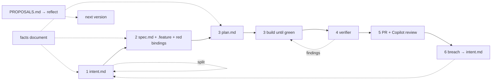

# balka

The six-stage AI-native SDLC playbook carried as a Claude Code plugin, so the
process is fixed in one place instead of re-derived by hand in every repo.
Commands for the stage transitions, two skills for when nobody types a command,
four hooks for the rules that must hold rather than be advised, and a reflect
step that turns what a repo learned into the next version of the loop.

Project-agnostic: no language, stack, framework or domain assumption anywhere in
it. All state is plain markdown, Gherkin and YAML in the project's own git.

```
commands/        one per stage transition, plus init, verify and reflect
skills/
  balka-artifacts        the house rules, for prose asks
  balka-watch-writeback  the headless Stage 6 diagnosis
templates/       the twelve shipped artefacts, read via ${CLAUDE_PLUGIN_ROOT}
hooks/           hooks.json registers all four; each is inert without opt-in
scripts/watch.py the Stage 6 detector — stdlib + gh, no model in the path
scripts/claim.sh one change, one main agent: reserves change numbers
scripts/board.py the board: every change in every worktree, served locally
tests/run.sh     every hook blocking and silent, every detection rule; no network
```

## Install

```bash
claude plugin marketplace add meteoFurletov/skills
claude plugin install balka@meteof-skills
```

Then, in a repo you want to run the loop in:

```
/balka:init
```

`init` writes an opt-in marker, the facts document, the proposals inbox, a
starter `AGENTS.md` block and the review policy. It merges with what is there
and never overwrites; on a conflict it reports and stops. Adopt one play at a
time with `--artifacts`, `--hooks`, `--gate` and `--watch`.

## The loop

The stages are the playbook's, numbered as it numbers them.

| Stage | Command | Writes | Gate |
| --- | --- | --- | --- |
| 1 Plan | `/balka:intent` | `intent.md` | the owner says accepted |
| 2 Design | `/balka:spec` | `spec.md`, `.feature` files, bindings written red | the owner reads every scenario in full |
| 3 Build | `/balka:plan`, then `/balka:build` | `plan.md`, code | the owner's read of the plan; then nothing until green |
| 4 Test | `/balka:test` | nothing — a fix or a stop, then `Status: built` | a verifier that did not write the code |
| 5 Deploy | `/balka:deploy` | the pull request, fixes from its review | Copilot code review; the code owner merges |
| 6 Maintain | `/balka:watch` | `bands.yaml`, the detector | a metric breach becomes a draft `intent.md` |
| any | `/balka:board` | nothing — a live kanban of every change | — |
| any | `/balka:verify` | the `verify` block in `.claude/balka.json` | — |
| any | `/balka:reflect` | the change list for the next version | the owner routes each item |



Stages chain in one session: intent and spec offer to continue once accepted,
an accepted plan is the decision to build and runs into Build without a second
question, and Build runs into Test on its own.

Three things keep the artefacts short. Each links upstream instead of restating
it. Every artefact names one owner. And size comes from scope: one change is one
capability, one or two `.feature` files, and an intent that needs more is split
into children rather than cut — the parent stays with `Status: split`.

Artefacts live one directory per change, `<artifactDir>/<NNN>-<slug>/`, and a
change lives on one branch with one main agent. There is no pointer to an
active change; see [Worktrees](#worktrees).

## Worktrees

One change, one branch, one main agent. A worktree session is the natural home
for that: in the Claude desktop app, start a session with **worktree** on, or run
`claude --worktree <name>` in a terminal.

- `/balka:intent` claims the next change number for that worktree. The claim
  lives in the repo's shared `.git`, so an agent in another worktree gets the
  next number, and is refused if it tries to work on yours.
- Stay in the one session from intent to deploy. A new session with worktree
  on starts a *new* worktree from the default branch, without your intent and
  spec. For a clean context between stages, `/clear` in the same session: each
  stage reads what it needs from the committed artefacts.
- Each stage commits its artefacts on the branch, so the worktree never holds
  the only copy.
- The hooks follow the session into its worktree: they read the hook input's
  `cwd`, not the checkout the session started in.
- After the merge, archive the session. The app removes the worktree and its
  branch, and the claim lapses with it.

## Board

`/balka:board` opens a live kanban of every change in the repo, across every
worktree, in the desktop app's Browser pane; anywhere else it prints the board
as markdown. It reads the `Status:` lines, the claims and the pull requests from
`gh` on every refresh and writes nothing, so parallel agents have nothing to
contend over.

Cards cannot be dragged. A card moves when its stage finishes and the owner
accepts it, so each card offers its next command instead: a copy button, and a
`claude-cli://` link that opens a terminal session in that change's worktree
with the command typed.

The first run adds a `balka-board` entry to `.claude/launch.json`. It finds the
plugin when it runs, so it is safe to commit, and from then on the board is in
the session toolbar's server menu.

## The facts document

Every stage reads it before drafting. It holds the estate's real names, the
facts the code does not say, and how changes land — repos, merge order, what to
run after. A name corrected in chat twice goes there once, and a scenario that
spells a system differently from that file is wrong before the owner reads it.

## Scenarios are the contract

The design transition turns each plain-words behaviour from the intent into a
Gherkin `.feature` file, in production's words, and — where the repo has a
runner — writes the step definitions at the same time, red. Each `Then` asserts
the observable result; `Given` and `When` reach code that may not exist yet.
Build's job is to turn them green by changing code and binding glue, never an
assertion. Test's verifier diffs the bindings against the design commit to see
that it did not.

Unit tests are the opposite: implementation detail, free to churn, and never
evidence on their own that a scenario holds.

## Test produces a fix or a stop

The verifier is a subagent with a fresh context. It checks the spec against the
scenarios, the scenarios against their bindings, the code against the spec, and
the plan against what was touched. It writes no file: a finding in code goes
back to Build and is fixed; a finding against a scenario, an assertion or the
spec stops the loop for the owner. The pull request's review is the record.

## Deploy

The agent that wrote the code does not approve it. `/balka:deploy` opens
the pull request, Copilot code review applies `.github/copilot-instructions.md`
to it — requested automatically by a repository ruleset — and the command
addresses every finding: fix, reply why not, record a departure, or stop when a
comment asks for the contract to change. Merging stays with the code owner, and
how the change lands is printed from the facts document, because a landing
pipeline is a repo's own.

## Hooks

Registered by the plugin in every session, and inert in any repo without a
`.claude/balka.json`. Each script's first act is to look for that file and exit if
it is absent, so opting in is one file and upgrading the plugin upgrades every
opted-in repo at once — no copies to drift.

| Hook | Fires on | Blocks |
| --- | --- | --- |
| `protect-scenarios` | `Edit`/`Write`/`MultiEdit` | A write over an **existing** `.feature` file. New ones pass. |
| `scenario-commit` | `Bash`, `git commit` | A commit that modifies, deletes or renames an existing `.feature` file, unless a change's `spec.md` is staged with it. New files pass. |
| `plan-sync` | `Bash`, `git commit` | A commit no single accepted `plan.md` covers in its *Files that change*, unless a `plan.md` is staged with it. |
| `deploy-gate` | `Bash` | Nothing — it *asks*. Only active once `init --gate` writes a `gate` object. |

The first three allow or block with no human in the path. `deploy-gate` is the
only one that pauses, and it is out of the Build path by construction. A hook
that cannot establish its condition allows the action and says why — ambiguity
never blocks, and none of them ever returns an explicit `allow`, which would
bypass your own permission settings. A block prints what it stopped, the rule,
and the route through it.

**Why two scenario hooks.** `protect-scenarios` sees the Edit and Write tools
and nothing else; an agent working through the shell rewrites a `.feature` file
without it noticing. `scenario-commit` closes that at the commit, whatever
wrote the file, and turns the rule into the pairing review looks for: a
scenario moves only in a commit that also moves the spec.

Artefact concision, linking upstream, the owner field and scenario coverage are
deliberately *not* hooks. None has a test a script can run without guessing at
intent, and a gate that guesses is a gate that gets switched off.

## `.claude/balka.json`

| Key | Meaning |
| --- | --- |
| `version` | `2`. `init --hooks` upgrades a version 1 file in place. |
| `artifactDir` | Where change directories live. Default `docs/balka`. |
| `artifactPaths` | Globs `plan-sync` never requires a plan entry for. Must include the facts document, `AGENTS.md`, `CLAUDE.md`, `REVIEW.md` and `.github/copilot-instructions.md`, which are artefacts living outside the artefact directory. |
| `scenarioGlobs` | What the two scenario hooks protect. |
| `facts` | The facts document. Default `docs/estate.md`. |
| `verify` | The `build`, `test`, `lint` and `scenarios` commands, written by `/balka:verify`. `null` means no such check; `scenarios: null` means no runner and the `.feature` files are the checklist the verifier reads by hand. |
| `deploy` | `"pr"` opens a pull request and runs the review loop; `"manual"` only prints how the change lands. |
| `gate` | Absent unless `init --gate` ran. Holds `approver` and `deployPatterns`. |
| `watch` | Absent unless `init --watch` ran. |

Globs take `*`, `?` and `**`. Brace expansion is not supported. `deployPatterns`
are shell globs matched against a command line, so `*` crosses `/` there.

## Reflect

The loop changes by evidence, not by chat. A correction that repeats is recorded
once in `<artifactDir>/PROPOSALS.md`. `/balka:reflect` reads that inbox, the
change directories and the git history, asks the owner for their own notes, and
produces a change list with each item routed: to the plugin, for the next
version; to the project, applied now; or dropped, with the reason. Plugin-bound
items stay in the inbox with their route, so the plugin's own reflect run can
pick them up. Nothing is ever deleted from that file.

## Stage 6

`scripts/watch.py` pulls CI history with `gh`, computes a daily failure rate, and
applies Western Electric rules over a rolling mean and standard deviation,
matched against a version-controlled `bands.yaml`. No model runs in the detection
path. 1σ logs; 2σ invokes Claude read-only to diagnose and writes the result back
as a draft `intent.md`; 3σ additionally opens a PR carrying it.

Detection is one-sided — CI becoming more reliable is not an incident — and a
flat line short-circuits rather than dividing by a zero standard deviation.

`bands.yaml` is read by a restricted parser, because python3 stdlib has no YAML.
The shipped file states the subset it may use in its first comment.

The diagnosis run gets no write tools, and the script compares `git status`
before and after, reverting if anything else moved. "Writes back an intent and
nothing else" is not something prompting can guarantee.

`init --watch` requires `gh`, at least 30 calendar days of CI history **and** at
least 20 days carrying 3 or more runs, and refuses otherwise rather than
installing a detector with no stable baseline. A repo with no CI skips this
stage and says so in its `AGENTS.md`.

Stage 6 is the one part of this plugin copied into the project — GitHub Actions
cannot see your plugin cache. Re-run `/balka:watch` after upgrading.

## Tests

```bash
bash tests/run.sh
```

A scratch git repo per case, no network and no `gh`. Every hook is exercised both
blocking and staying silent, and every detection rule in isolation.

## Requirements

`bash` and `jq` for the hooks. `python3` (stdlib only) and `gh` for the watcher
and the deploy stage. Copilot code review on the GitHub account for the review
loop.

## History

Until 0.3.1 this was `sdlc-loop`, a plugin inside
[meteoFurletov/skills](https://github.com/meteoFurletov/skills). Its git history
came along. A repo set up under the old name keeps working: the hooks still read
`.claude/sdlc.json`, and `/balka:init` renames it, renames the `REVIEW.md`
markers and moves the `CLAUDE.md` block into `AGENTS.md`. To switch an install, uninstall `sdlc-loop@meteof-skills` and
install `balka@meteof-skills` in its place.

The name used to belong to a file-based personal OS for Claude Code. It is kept
on the [`v1-personal-os`](https://github.com/meteoFurletov/balka/tree/v1-personal-os)
branch and is no longer developed.

## License

MIT — see [LICENSE](LICENSE).
